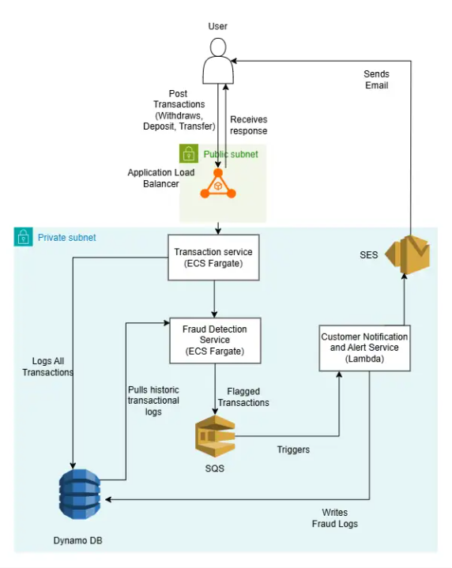

# Banking Fraud Detection and Alerting Service

## 1. Architecture Diagram
The system is built as a decoupled, event-driven microservice pipeline.

Summary - 
1. An Application Load Balancer securely exposes the application endpoints to the users through a public subnet in the VPC.
2. An AWS ECS Fargate cluster runs the containerized FastAPI application. This core component lives inside a private subnet and cannot be accesses directly from the open internet.
3. If a transaction is flagged as suspicious, the fargate service pushes it to the SQS Queue, which is listened by the lambda function. The lambda function sends an email alert through the AWS SES service and updates the database.
4. A single DynamoDB table manages transaction ledger logging and security alerts.  

## 2. Explanation of Fraud Detection Logic

### Rule 1: High-Risk Authentication (Failed Logins)
* Condition: if failed_login_attempts >=3
* The application performs In-Memory check to catch an account with more than 3 failed login attempts. The failed_login_attempts value is provided directly by the HTTP request.

### Rule 2: 
* Condition: This rule checks for sudden, massive cash drains. if transaction type == "withdrawal" and amount > 10000.0
* Similar to rule 1, this is a stateless filter. 

### Rule 3
* Transactions originating from different geographic locations within a timespan of 15 minutes (900 seconds).
* The Application scans the DynamoDB table, finds transaction logs starting with ("TRN#<accountId>").
* The matched history records are sorted by timestamp to capture the latest transaction location. If the location received from the incoming transaction differs from the location retrived from the database storing historical transactions, then it is flagged as an anomaly.

## 3. Steps to Deploy the Solution

### Prerequisites
Ensure local environment has the following tools installed and authenticated:
* AWS CLI configured with valid IAM credentials.
* Node.js (v18+) & AWS CDK Toolkit ('npm install -g aws-cdk').
* Python 3.9+ with 'pip' and 'virtualenv' .
* Docker Desktop running locally

### Deployement instructions

1. Clone github repository and cd to root directory.
cd BankFraudDetectionAndAlertService

2. Initialize and activate virtual environment
python -m venv .venv 
.\venv\Scripts\Activate [For Windows]
source .venv/bin/activate [FormacOS/Linux]

3. Install Dependencies
pip install -r requirements.txt

4. Bootstrap AWS Environment
cdk bootstrap

5. Deploy the infrastructure stack:
cdk deploy --app "python infrastructure/cdk_stack.py" --output infrastructure/cdk.out

6. After deployement, open the live Load Balancer URL.

## 4. API Usage Instructions

Base URL : http://Practi-Fraud-WvVFxZlT0xfn-331392164.us-east-1.elb.amazonaws.com
Interactive API Docs : http://Practi-Fraud-WvVFxZlT0xfn-331392164.us-east-1.elb.amazonaws.com/docs

### Endpoints

#### Process Transactions

URL: /api/transactions

Method: POST

Headers: Content-Type: application/json

#### Request Format JSON -

{
  "accountId": "ACC-9981A",
  "amount": 250.75,
  "transactionType": "withdrawal",
  "location": "Oakville, ON",
  "failedLoginAttempts": 0,
  "timestamp": "2026-06-18T08:16:01.314Z"
}

#### Response Format -

Example - Approved Transaction (HTTP 201 Created)

{
  "TransactionID": "TRN#ACC-9981A#2026-06-18T08:16:01.314000+00:00",
  "status": "approved",
  "RulesViolated": 0
}

Example - Flagged Transaction (HTTP 201 Created)

{
  "TransactionID": "TRN#ACC-9981A#2026-06-18T08:16:01.314000+00:00",
  "status": "flagged",
  "RulesViolated": 1
}

## Cleanup

To avoid ongoing AWS hourly costs from Load Balander and NAT gateways, destroy the stack.

cdk destroy --app "python infrastructure/cdk_stack.py"